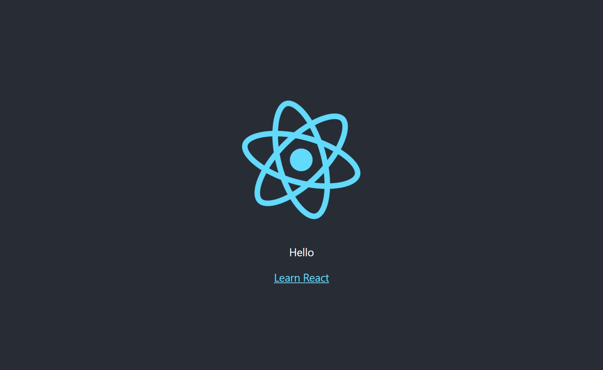
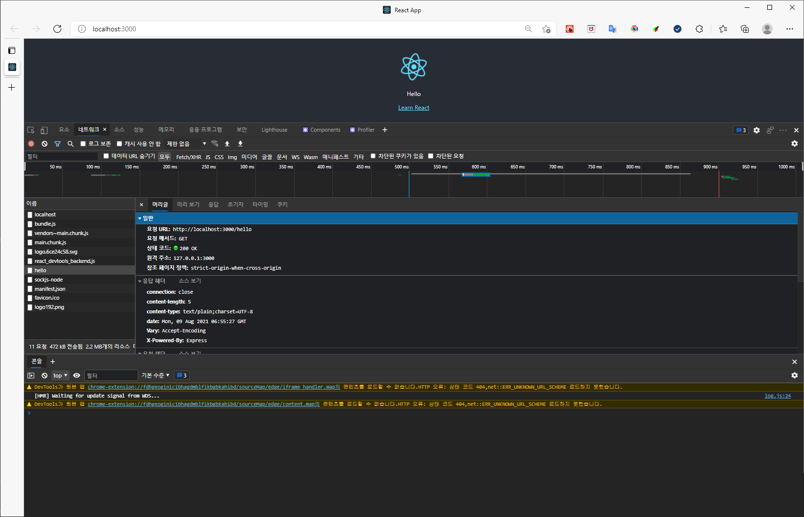

## 목차

- [Spring boot 와 React 연동하기](#spring-boot-와-react-연동하기)
  - [1. Spring boot 테스트 컨트롤러 작성](#1-spring-boot-테스트-컨트롤러-작성)
  - [2. React: Proxy 설정](#2-react-proxy-설정)
  - [3. 명령어를 통해 연결 확인](#3-명령어를-통해-연결-확인)
  - [4. React: `fetch`로 스프링부트 서버에 요청 보내기](#4-react-fetch로-스프링부트-서버에-요청-보내기)
  - [5. 결과 확인](#5-결과-확인)
- [FINALLY](#finally)

# Spring boot 와 React 연동하기

WishMovies 프로젝트는 Back-End 부분과 Front-End 부분을 나누어서 개발하기 위해  
각자 client와 server로 프로젝트를 분리했다.  

문제는 spring-boot의 서버 포트는 9090이고 React는 3000이며 CORS 문제가 발생하는데,  
> CORS(Cross-Origin Resource Sharing): 추가 HTTP 헤더를 사용하여, 한 출처(origin)에서 실행 중인  
> 웹 애플리케이션이 다른 출처(origin)의 선택한 자원에 접근할 수 있는 권한을 부여하도록 브라우저에 알려주는 체제  
> [https://developer.mozilla.org/ko/docs/Web/HTTP/CORS](https://developer.mozilla.org/ko/docs/Web/HTTP/CORS)  

이러한 문제를 해결하기 위해서는 React 프로젝트에서 Proxy 설정을 해줘야 한다.

## 1. Spring boot 테스트 컨트롤러 작성

React와 통신이 잘되는지 확인하기 위해 간단한 컨트롤러를 작성한다.

나는 controller 패키지 하위에 ReactTestController.java 클래스를 작성했다.  
이 클래스는 리액트와 통신 확인이 완료되면 제거할 것이기 때문에 클래스 이름과 URL은 아무렇게 설정해도 좋다.
```java
import org.springframework.web.bind.annotation.RestController;

@RestController
public class ReactTestController {
    @RequestMapping("/hello")
    public String hello() {
        return "Hello";
    }
}
```
위의 컨트롤러 클래스는 `/hello`로 url을 받고 `Hello` 텍스트 형태로 응답하는 형태이다.

## 2. React: Proxy 설정

`package.json` 파일에 아래의 프록시를 설정하는 구문을 추가한다.

```json
"proxy": "http://localhost:[스프링부트서버포트번호]",
```

## 3. 명령어를 통해 연결 확인

리액트 프록시 설정이 끝났다면 리액트 프로젝트와 스프링부트 프로젝트 서버를 둘 다 실행한다.  
두 서버가 정상적으로 실행이 완료되면 아래의 명령어로 스프링부트 컨트롤러에서 보내준 값이 제대로 출력되는지 확인한다.

```bash
$ curl localhost:3000/hello
Hello
```
위의 명령어에서 포트번호를 `9090`으로 변경후 확인해도 같은 결과가 출력됨을 볼 수 있다.

## 4. React: `fetch`로 스프링부트 서버에 요청 보내기

이제 프록시가 잘 동작하는 것을 확인했으니, 실제로 리액트에서 백단 서버로 요청을 날리고 응답을 받아보자.

App.js / App.jsx
```jsx
import logo from './logo.svg';
import './App.css';
import { useEffect, useState } from 'react';

function App() {
	const [message, setMessage] = useState('');

	useEffect(() => {
		fetch('/hello')
			.then((response) => response.text())
			.then((message) => {
				setMessage(message);
			});
	}, []);

	return (
		<div className="App">
			<header className="App-header">
				
				<p>{message}</p>
				<a
					className="App-link"
					href="https://reactjs.org"
					target="_blank"
					rel="noopener noreferrer"
				>
					Learn React
				</a>
			</header>
		</div>
	);
}

export default App;
```

위의 코드는 컴포넌트가 마운트 될때 fetch구문을 바로 실행하는 코드다.  
위의 코드를 정의하고 브라우저로 결과를 확인해 본다.

## 5. 결과 확인

- 결과 화면 (정상)



- 네트워크 검사 결과 (정상)



# FINALLY

프록시 설정을 통해 이제 프론트단에서 자유롭게 백엔드 서버단에 REST API를 호출할 수 있게 됐다.  
단, 스프링부트 서버와 리액트 서버가 둘다 실행되고 있는 상태여야 가능하여 두 서버를 둘다 서버가 제대로 실행되는지  
계속 확인해 줘야 하기 때문에 번거러울 수도 있다.  
하지만 아직?? 까지는 그렇게 불편한 개발 작업 과정이라 생각되지 않는다.  
불편하다고 느껴지면 **스프링부트에서 NPM을 함께 패키징하여 빌드**되도록 해보겠다.